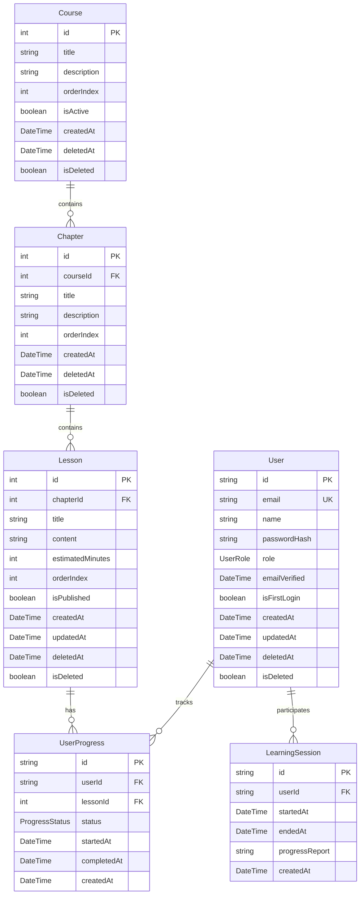

# データベース設計 - ER図

## ER図

## データベース設計の特徴

### 主要エンティティ
- **User**: システム利用者（学習者、講師、管理者）
- **Course**: コース（学習単位の最上位）
- **Chapter**: チャプター（コース内の章）
- **Lesson**: レッスン（実際の学習コンテンツ）
- **UserProgress**: ユーザーの学習進捗
- **LearningSession**: 学習セッション

### 設計の特徴
1. **階層構造**: Course → Chapter → Lesson の3層構造
2. **ソフトデリート**: deletedAt, isDeleted による論理削除対応
3. **進捗管理**: UserProgress による詳細な学習状況追跡
4. **学習時間管理**: LearningSession による学習時間・レポート記録（レッスン進捗とは独立）
5. **ユーザー役割**: ADMIN, INSTRUCTOR, LEARNER の3役割

### Enum定義
- **UserRole**: ADMIN, INSTRUCTOR, LEARNER
- **ProgressStatus**: NOT_STARTED, IN_PROGRESS, COMPLETED